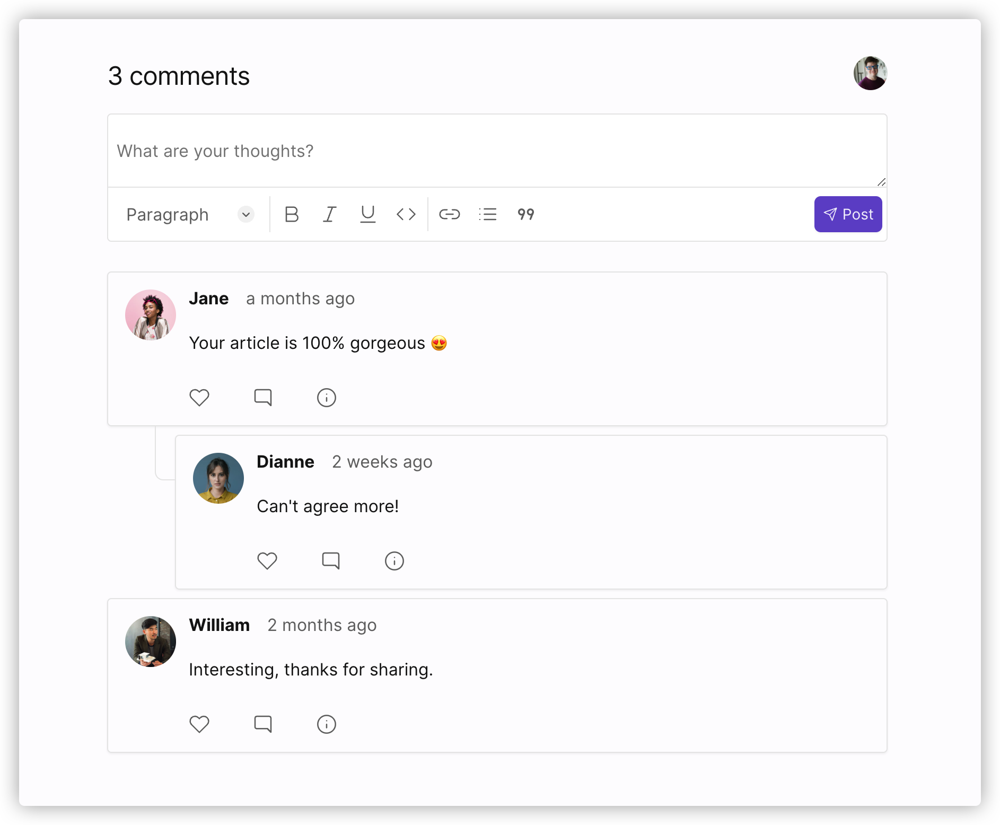

👋  大家好，在独立开发一年后，今天开源了我的 Next.js App - [Chirpy](https://github.com/devrsi0n/chirpy), 一个主打保护隐私、支持主题定制的评论组件 SaaS。

## 太长不看版 🙈

这是 [GitHub Repo](https://github.com/devrsi0n/chirpy), 欢迎点亮 🌟  收藏，欢迎参与贡献。对于初、中级工程师这里有所有你需要知道的一个完整的 SaaS 怎么运作的全部知识，非常适合学习。

[官网](https://chirpy.dev/)目前正在 beta 测试，欢迎试用。如果想要数据完全由你控制，Chirp 也支持 [docker 部署](https://chirpy.dev/docs/self-hosted) 。

## 预览 👀

评论组件，支持富文本编辑和 [markdown shortcuts](https://chirpy.dev/docs/features/markdown) （markdown 实时预览，类似 [typora](https://typora.io/) 的书写体验）



主题定制 🌈（更多定制项开发中）


组件使用情况分析面板(Analytics) 📈


## 初心 ❤️

我在构建我自己的[博客](https://devrsi0n.com)的时候想要一个类似 [Disqus](https://disqus.com/) 一样的功能丰富、接入快捷的评论组件，但 Disqus 本身这几年因为不经用户同意就私加广告，出卖用户隐私等问题广为诟病。下面是我检索到的一些报道：

[Bloomberg LawDisqus Faces \$3 Million Sanction Over Alleged GDPR Breachesfor multiple breaches of EU privacy law.](https://news.bloomberglaw.com/privacy-and-data-security/disqus-faces-3-million-sanction-over-alleged-gdpr-breaches)

[](https://news.bloomberglaw.com/privacy-and-data-security/disqus-faces-3-million-sanction-over-alleged-gdpr-breaches)[Disqus facing \$3M fine in Norway for tracking users without consent](https://techcrunch.com/2021/05/05/disqus-facing-3m-fine-in-norway-for-tracking-users-without-consent/)

我也用过 [gitalk](https://github.com/gitalk/gitalk) [utterances](https://github.com/utterance/utterances) 之类的基于 GitHub API 的免费评论系统，它们有一个显而易见的问题就是只支持 GitHub 登陆，而且受限 GitHub 本身 API，很多功能并不好做，比如组件的使用情况分析/ Analytics。

市面的组件基本都缺乏主题定制能力，放在自己的博客、网站有很大概率因为设计不协调导致的违和感，所以主题定制也是必要的。

基于以上种种问题所以我打算做一个完全开源同时也能解决以上痛点的评论组件系统。

## 技术选择与演进 🕺

### Next.js 🆚 Gatsby

时间倒回到 2020 年，当年 React SSR 框架 Next.js 推出了 [SSG](https://nextjs.org/blog/next-9-3#next-gen-static-site-generation-ssg-support)（Static Site Generation）和 [ISR](https://nextjs.org/blog/next-9-5#stable-incremental-static-regeneration)（Incremental Static Regeneration）, 迅速变得炙手可热，相比 2019 年大热的静态网站生成器 Gatsby 优势明显。（如果放在今天重新选择，[remix](https://remix.run/) 也是一个非常好的选择。😄）

|             | Gatsby | Next.js |
| ----------- | ------ | ------- |
| SSR         | 🔴     | ✅      |
| SSG         | ✅     | ✅      |
| ISR         | 🔴     | ✅      |
| BUILD SPEED | 🐌     | ⚡️     |
| HMR SPEED   | 🐌     | ⚡️     |

[npm 趋势图](https://www.npmtrends.com/gatsby-vs-next)：


Next.js 的 [ISR](https://vercel.com/docs/concepts/next.js/incremental-static-regeneration#fetching-data)（增量静态更新） 特性特别适合评论组件的场景。想象有成千上万个 iframe 评论组件，用 ISR 渲染既有了类似 SSR 的灵活性，也有 CDN 的加速加持（减少并发渲染）。下图是 ISR 示意：


一开始 Chirpy 选择了 egoist 的 [Next FullStack Starter](https://github.com/egoist/next-fullstack-starter) 作为始点，主要技术栈是：Next.js + [Prisma](https://prisma.io/) + [GraphQL](https://graphql.org/) + [TypeGraphQL](https://typegraphql.com/) + [Tailwindcss](https://tailwindcss.com/)。但深入开发过程中发现 ORM Prisma 并不支持 [Subscription/real-time API](https://github.com/prisma/prisma/issues/298)，这是一个对用户体验比较重要的功能，在慎重考虑之后 backend 迁移到了 [Hasura](https://github.com/hasura/graphql-engine)。

### [Prisma](https://prisma.io/) ➡️ [Hasura](https://github.com/hasura/graphql-engine)

严格来说 [Prisma](https://prisma.io/) 和 [Hasura](https://github.com/hasura/graphql-engine) 并不算是同一类东西。[Hasura](https://github.com/hasura/graphql-engine) 是一个支持高并发的 GraphQL server，支持用 GraphQL 增删改查数据库(比如 [PostgreSQL](https://www.postgresql.org/))，同时也提供一套完整的权限控制。[Prisma](https://prisma.io/) 是一个 ORM，为了支持 GraphQL 还是需要手写所对应的 [resolver](https://www.apollographql.com/docs/tutorial/resolvers/) 以及相应的权限控制，开发成本较高，但相应的比 Hasura 更加灵活。

|              | Prisma                              | Hasura                        |
| ------------ | ----------------------------------- | ----------------------------- |
| 语言         | TypeScript                          | haskell                       |
| Type         | ORM                                 | GraphQL Server                |
| GraphQL API  | 🟡  手动                            | ✅  由数据库 Schema 生成      |
| 高并发       | 🟡  受限于   Node.js 性能和应用架构 | ✅  (50M 内存支持 1000 q/sec) |
| Subscription | 🔴                                  | ✅                            |
| 灵活性       | ✅                                  | 🟡                            |

Hasura 应用的架构


### [passportjs](https://www.passportjs.org/) ➡️ [next-auth](https://next-auth.js.org/)

用户登陆系统（第三方登陆 + 传统账号密码）也有 2 个比较成熟的选择，一开始选择的是 [passportjs](https://www.passportjs.org/), 在深入开发中遇到很多 OAuth 和安全相关的问题，最后重构换到了 next-auth。相比之下 next-auth 更加现代化（提供 React Hooks，库本身也是用 TypeScript 写的），更安全，Next.js 集成方便。

|              | passportjs | next-auth |
| ------------ | ---------- | --------- |
| 第三方登陆   | ✅         | ✅        |
| 邮箱密码登陆 | ✅         | ✅        |
| 无密码登陆   | ✅         | ✅        |
| 安全性       | 🟡         | ✅        |
| React Hooks  | 🔴         | ✅        |
| Next.js 集成 | 🔴         | ✅        |

### [Tailwindcss](https://tailwindcss.com/) ＆ [twin.macro](https://github.com/ben-rogerson/twin.macro) & [radix-colors](https://www.radix-ui.com/colors)

[Tailwind](https://tailwindcss.com/) 是一个原子化 CSS 开发框架，在熟悉它之后 CSS 开发效率能显著的提升 🚀；同时它提供了一套完备且经得住考验的[默认主题配置](https://tailwindcss.com/docs/theme)，以及一套丰富的 [SaaS UI 库](https://tailwindui.com/)（不完全免费，但学会 tailwind 之后手写类似的 UI 不会太难，更重要的是这里有常用 SaaS 的 UI 设计可供参考，对我这个设计苦手非常有帮助 🥳）。

实际上 Chirpy 是和 [twin.macro](https://github.com/ben-rogerson/twin.macro) 一起用，这是一个结合 tailwind 和 CSS-in-JS（styled-component & emotion） 的库，tailwind 早期版本在组件化开发中会遇到样式类不能被 overwrite 的情况, 因为 tailwind 本身输出原子类：

```jsx
<p className="w-1 h-1">...</p>

// 输出 CSS 👇

.w-1	{
  width: 0.25rem;
}

.h-1	{
  height: 0.25rem;
}
```

twin.macro 版本, 不需要 CSS `!important` 就能覆盖样式：

```html
<p tw="w-1 h-1">...</p>

// 输出 html & css 👇

<p class="random-name">...</p>

.random-name { width: 0.25rem; height: 0.25rem; }
```

twin.macro 也支持 build 的时候校验，不合法的样式会报错（比如`w-0.1`)，可以避免写出无用样式。以及自由组合多个 variants，例如：`sm:(bg-black hover:(bg-white w-10))`。当然它也并不完美，tailwind 可以复用已有的 CSS 类，而它每个 tw 几乎都会生成新的样式, 最终输出的 bundle size twin 会更大一点。它也不支持一些 tailwind 的一些官方插件，比如：[tailwindcss-typography](https://github.com/tailwindlabs/tailwindcss-typography)（用于编辑器）。故两者是结合一起使用。

tailwind 的 Dark mode 主要靠用 `dark:` variant（如下面的 🌰）, 几乎每个颜色值都要写两遍，我理想中的 dark mode 是自动的。

```html
<div class="bg-white dark:bg-gray-900">...</div>
```

因此这里需要 light/dark 2 套颜色，[radix-colors](https://www.radix-ui.com/colors) 正满足要求。但它要怎么和 tailwind 一起用呢？答案是：[CSS Variable](https://developer.mozilla.org/en-US/docs/Web/CSS/Using_CSS_custom_properties)。

首先配置 tailwind 主题:

```jsx
module.exports = {
  theme: {
    colors: {
      bg: `var(--tw-colors-bg)`,
    },
  },
};
```

然后给应用注入样式：

```css
:root {
  --tw-colors-bg: white;
}
:root.dark {
  --tw-colors-bg: black;
}
```

配合 [next-themes](https://github.com/pacocoursey/next-themes) 自动在用户切换 mode 时切换网站 CSS 类:

```html
// next-themes 在用户切换 mode 时自动切换 .dark 有无
<html class="dark">
  ...
</html>
```

这样就能在应用切换 mode 时自动刷新颜色。

这里也顺便解决了组件的主题定制功能， Chirpy 只需要在组件渲染时注入用户自定义的变量值即可。

### [Slate](https://github.com/ianstormtaylor/slate) ➡️ [tiptap](https://github.com/ueberdosis/tiptap)

评论组件体验最核心的是富文本编辑器，一开始 Chirpy 用的是 [slate](https://github.com/ianstormtaylor/slate)，因为它和 React 结合比较好，但开发到后期也遇到一些问题，比如 [markdown shortcuts](https://chirpy.dev/docs/features/markdown) 实现并不顺利，后面迁移到了[tiptap](https://github.com/ueberdosis/tiptap)，功能更加完善，底层也基于更稳定的 [ProseMirror](https://github.com/ProseMirror/prosemirror)。

|                    | slate    | tiptap      |
| ------------------ | -------- | ----------- |
| 基于               | React    | ProseMirror |
| 稳定性             | 🔴 issue | ✅          |
| Markdown shortcuts | 🔴       | ✅          |
| 功能丰富度         | 🔴       | ✅          |

### [apollo-client](https://github.com/apollographql/apollo-client) ➡️ [urql](https://github.com/FormidableLabs/urql)

[apollo-client](https://github.com/apollographql/apollo-client) 毫无疑问是最流行的 GraphQL client，最初选择的便是它。就在准备开源之前不久遇到了 2 个很诡异的 bug（某些状态死活不更新）。搜索相关问题也了解到 [apollo 把开源当成一种营销手段](https://blog.logrocket.com/why-i-finally-switched-to-urql-from-apollo-client/)，加之我一直很头痛它很大的 bundle size，随后下定决心[迁移到 urql](https://github.com/devrsi0n/chirpy/pull/85) 这个小巧的多的库，事实证明这次重构超值，减少了近 45KB bundle size。


|                        | apollo-client | urql          |
| ---------------------- | ------------- | ------------- |
| bundle size            | 🟡 33kb       | ✅ 7.1kb      |
| Next.js 集成           | 🔴            |  ✅ next-urql |
| Document Caching       | 🔴            | ✅            |
| Stale while Revalidate | ✅            | ✅            |

### [Plausible](https://github.com/plausible/analytics) 📈

一开始 Chirpy 自己实现了一个的数据统计/ Analytics，但后面发现这里面需要考虑很多东西（聚合数据、性能、图表等），严重拖累了开发进度。最后迁移到了 [Plausible](https://github.com/plausible/analytics)，它也是一个主打保护隐私的开源 SaaS。为了更好地保护用户隐私，Chirpy 用它跑在一个单独的服务器上而不是直接用它的服务。

Chirpy 复用了 Plausible 的前端代码以适配评论组件的场景。同时也把它发数据的脚本直接放到 Chirpy 的 bundle + 重映射发数据的 API 接口，可以很好的解决浏览器[广告过滤器过滤掉请求](https://plausible.io/docs/proxy/introduction)导致数据不准确的问题。因此你可以把 Chirpy 当成一个免费且高精确度的 Analytics 工具来用 😉。

[Plausible 的营收](https://twitter.com/PlausibleHQ/status/1473932247636090880)也是 Chirpy 努力的目标 💪


## CI & CD ♻

项目的 CI/CD 主要依靠 GitHub Action。 开发流程是基于 PR ，每个 PR check-in 之前会跑 Cypress( 端到端测试），jest（单元测试），以及输出 Next.js bundle size 变化（避免无意引入代码造成 bundle size 问题）。

后面会引入 [hasura schema CI/CD](https://github.com/tibotiber/hasura-action)，减少人肉升级 schema 出问题。

## 部署 💿

这里分为 Next.js, Hasura 和 Plausible 几部分：

- Next.js 自然选择部署到开发它的公司 → [Vercel](https://vercel.com/) 是最佳选择，相比同类服务（比如 [netlify](https://www.netlify.com/)）构建性能、图片之类的优化效果更好，部署体验也属一流。
- Hasura 前置了一个 [Caddy](https://github.com/caddyserver/caddy) HTTP Server 可以自动给 HTTPS 域名签名，同时也为未来支持弹性负载均衡作准备。
- Plausible 实例单独部署避免影响业务数据，同时也加上了 [Caddy](https://github.com/caddyserver/caddy) HTTP Server。
- Hasura 和 Plausible 各自部署到了一个 [DigitalOcean](https://www.digitalocean.com/?refcode=92c5af253f6a&utm_campaign=Referral_Invite&utm_medium=Referral_Program&utm_source=badge) 虚拟机，主要看中高性价比，使用方便。

后续支持图片上传考虑使用 [Cloudflare Images](https://www.cloudflare.com/products/cloudflare-images/), 功能齐全，性价比也不错。

## 远期规划 🛸

评论组件只是我的第一步，在功能逐渐完善之后 Chirpy 也会考虑做类似 [intercom](https://www.intercom.com/) 的聊天组件（如下图），hasura + WebSocket 架构天然适合这种轻量聊天应用。Chirpy 目标是打造一套完整的开源用户沟通的解决方案。


## 社区/community 🏘

作为开源项目，社区是我很看重的一块，鼓励大家参与贡献（issue，discussion，PR）。计划有了一定收入也会定期给活跃的开发者发放一定的金钱支持，回馈社区。欢迎到 [Chirpy](https://github.com/devrsi0n/chirpy) 社区玩耍 🙌。

非常感谢你看到这里。👇 下面就是一个 Chirpy 评论组件，欢迎使用。
